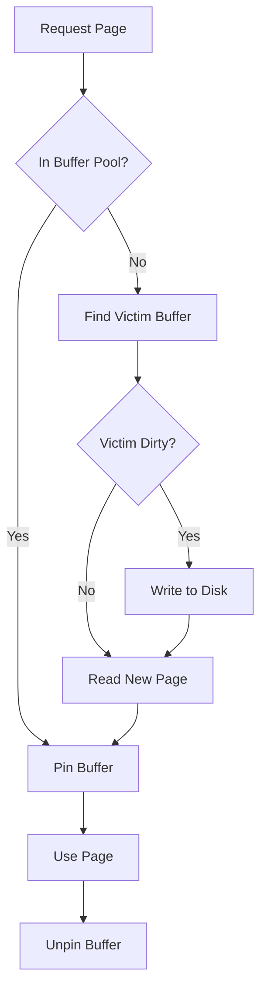
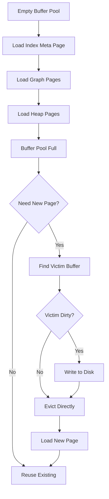
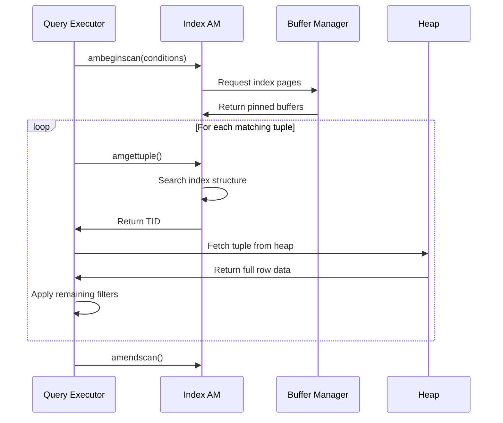
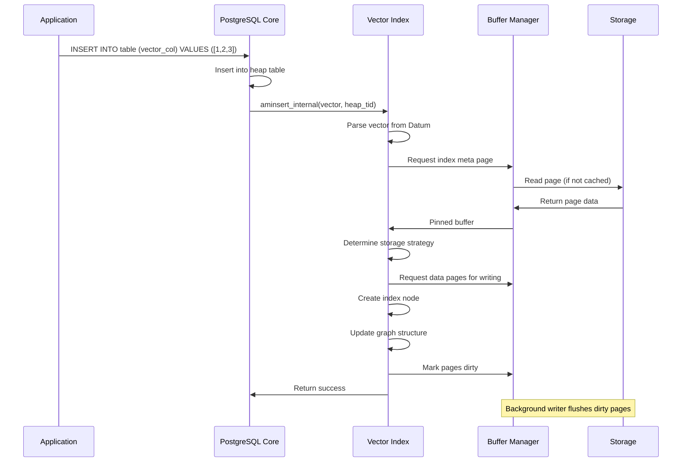
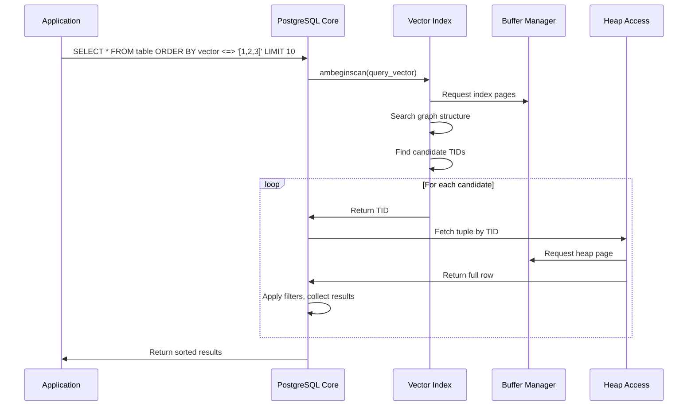

# PostgreSQL Storage Architecture and Data Access Patterns

## Table of Contents
1. [Core PostgreSQL Storage Concepts](#core-postgresql-storage-concepts)
2. [Memory Management and Caching](#memory-management-and-caching)
3. [Transaction and Concurrency Control](#transaction-and-concurrency-control)
4. [How Index Access Methods Work](#how-index-access-methods-work)
5. [Code Deep Dive: pgvectorscale Implementation](#code-deep-dive-pgvectorscale-implementation)
6. [Data Flow Examples](#data-flow-examples)
7. [Auxiliary Storage Structures: Visibility Maps and Free Space Maps](#auxiliary-storage-structures-visibility-maps-and-free-space-maps)

## Core PostgreSQL Storage Concepts

### 1. The Storage Hierarchy

PostgreSQL organizes data in a multi-layered hierarchy:

```
Database Cluster
├── Database 1
│   ├── Schema 1
│   │   ├── Table A (Heap)
│   │   ├── Index A1 (B-tree, GiST, etc.)
│   │   └── Index A2 (Custom: diskann)
│   └── Schema 2
└── Database 2
```

#### Physical Storage Structure

```
Tablespace (Directory on disk)
├── Database Directory (OID-based name)
│   ├── Relation Files (16384, 16385, etc.)
│   │   ├── Main Fork (actual data)
│   │   ├── Visibility Map Fork
│   │   └── Free Space Map Fork
│   └── WAL Files (Write-Ahead Log)
```

#### How Logical Hierarchy Maps to Physical Storage

The mapping from logical concepts to physical files is crucial to understand:

```
Logical Layer                Physical Storage
─────────────────────────────────────────────────────────────────

Database Cluster     ───────► Base directory (e.g., /var/lib/postgresql/data)
    │                         │
    │                         ├── postgresql.conf (cluster config)
    │                         ├── pg_hba.conf (authentication)
    │                         └── base/ (database storage)
    │
    ├── Database 1    ───────► base/16384/ (directory named by OID)
    │   (OID: 16384)          │
    │   │                     ├── 1259 (pg_class system catalog)
    │   │                     ├── 1249 (pg_type system catalog)
    │   │                     └── ... (other relation files)
    │   │
    │   ├── Schema 1
    │   │   │
    │   │   ├── Table A ──────► base/16384/24576 (main fork)
    │   │   │ (OID: 24576)     ├── base/16384/24576_vm (visibility map)
    │   │   │                  ├── base/16384/24576_fsm (free space map)
    │   │   │                  └── base/16384/24576.1, 24576.2... (overflow segments)
    │   │   │
    │   │   ├── Index A1 ─────► base/16384/24577 (B-tree index file)
    │   │   │ (OID: 24577)
    │   │   │
    │   │   └── Index A2 ─────► base/16384/24578 (diskann vector index file)
    │   │     (OID: 24578)
    │   │
    │   └── Schema 2...
    │
    └── Database 2    ───────► base/16385/ (different database directory)
        (OID: 16385)


WAL Files            ───────► pg_wal/000000010000000000000001 (sequential WAL segments)
```

#### Detailed File Organization

**1. Object Identifier (OID) System**
```
Every database object gets a unique OID:
┌─────────────────────────────────────┐
│ Object Type    │ Example OID Range  │
├─────────────────────────────────────┤
│ Databases      │ 16384 - 24575     │
│ Tables         │ 24576 - 32767     │  
│ Indexes        │ 32768 - 40959     │
│ Custom Types   │ 40960 - 49151     │
└─────────────────────────────────────┘
```

**2. Relation File Structure**
```
For Table with OID 24576:
┌─────────────────────────────────────────────────────────────┐
│ File Name        │ Purpose                                  │
├─────────────────────────────────────────────────────────────┤
│ 24576           │ Main data fork (heap pages)             │
│ 24576_vm        │ Visibility map (MVCC optimization)      │
│ 24576_fsm       │ Free space map (insertion optimization) │
│ 24576.1         │ Overflow segment (if > 1GB)            │
│ 24576.2         │ Second overflow segment                 │
└─────────────────────────────────────────────────────────────┘
```

**3. Page Layout Within Files**
```
File: base/16384/24576 (Table data)
┌─────────────────────────────────────┐
│ Page 0: (8KB) Table metadata        │ ← Special first page
├─────────────────────────────────────┤
│ Page 1: (8KB) Row data              │ ← Your actual table rows
├─────────────────────────────────────┤
│ Page 2: (8KB) More row data         │
├─────────────────────────────────────┤
│ Page 3: (8KB) Partially filled     │
├─────────────────────────────────────┤
│ Page 4: (8KB) Empty (available)    │
└─────────────────────────────────────┘

File: base/16384/24578 (Vector index)
┌─────────────────────────────────────┐
│ Page 0: (8KB) Index metadata        │ ← Your MetaPage
├─────────────────────────────────────┤
│ Page 1: (8KB) Graph nodes           │ ← Vector storage
├─────────────────────────────────────┤
│ Page 2: (8KB) Neighbor lists        │ ← Adjacency info
├─────────────────────────────────────┤
│ Page 3: (8KB) SBQ quantization data │ ← Compression data
└─────────────────────────────────────┘
```

#### Example: Vector Index File Mapping

In your pgvectorscale code, here's how it maps:

```rust
// Your index gets assigned an OID when created
CREATE INDEX vector_idx ON embeddings USING diskann (embedding);
// This creates file: base/{database_oid}/{index_oid}

// Your MetaPage goes to page 0
impl MetaPage {
    const META_PAGE_BLOCK: BlockNumber = 0;
    
    pub unsafe fn create(relation: &PgRelation, ...) -> Self {
        // Writes to block 0 of the index file
        let buffer = LockedBufferExclusive::new(relation, Self::META_PAGE_BLOCK);
        // Physical location: base/16384/24578 bytes 0-8191
    }
}

// Your vector data goes to subsequent pages
impl Tape {
    pub fn write(&mut self, data: &[u8]) -> TapePosition {
        // Allocates new pages as needed: blocks 1, 2, 3...
        // Physical locations: 
        // - base/16384/24578 bytes 8192-16383 (page 1)
        // - base/16384/24578 bytes 16384-24575 (page 2)
        // - etc.
    }
}
```

#### Real-World Example

If you have a database with:
- Database name: `vector_db` (OID: 16384)
- Table: `embeddings` (OID: 24576)  
- Vector index: `vector_idx` (OID: 24578)

The physical files would be:
```
/var/lib/postgresql/data/
├── base/16384/                    ← vector_db database
│   ├── 24576                      ← embeddings table (main fork)
│   ├── 24576_vm                   ← embeddings visibility map
│   ├── 24576_fsm                  ← embeddings free space map
│   ├── 24578                      ← vector_idx index file
│   └── ... (other objects)
└── pg_wal/
    ├── 000000010000000000000001    ← WAL segment 1
    └── 000000010000000000000002    ← WAL segment 2
```

When you query `SELECT * FROM embeddings ORDER BY embedding <=> '[1,2,3]'`:

1. **Index scan** reads from `base/16384/24578` (your vector index)
2. **Heap fetch** reads from `base/16384/24576` (actual table data)
3. **WAL writes** go to `pg_wal/` if any modifications occur

### 2. Pages: The Fundamental Storage Unit

Every piece of data in PostgreSQL lives in **pages** (also called blocks):

```
Page Structure (8KB default)
┌─────────────────────────────────────┐
│ Page Header (24 bytes)              │
├─────────────────────────────────────┤
│ Item Pointers Array                 │  ← Points to actual tuples
├─────────────────────────────────────┤
│ Free Space                          │
├─────────────────────────────────────┤
│ Tuple Data (grows upward)           │
├─────────────────────────────────────┤
│ Special Space (index-specific)      │
└─────────────────────────────────────┘
```

**Key Concepts:**
- **Page Size**: Fixed at 8KB (configurable at compile time)
- **Atomic I/O**: PostgreSQL never reads/writes partial pages
- **Item Pointers**: Indirection layer allowing tuple movement within page
- **Special Space**: Used by indexes for metadata (B-tree nodes, etc.)

### 3. Heap vs Index Storage

#### Heap Tables (The Source of Truth)

```
Heap Table Structure
┌─────────────────────────────────────┐
│ Page 0: Table metadata              │
├─────────────────────────────────────┤
│ Page 1: Row data                    │
│  ├── Row 1 (TID: (1,1))            │
│  ├── Row 2 (TID: (1,2))            │
│  └── Row 3 (TID: (1,3))            │
├─────────────────────────────────────┤
│ Page 2: More row data               │
│  ├── Row 4 (TID: (2,1))            │
│  └── Row 5 (TID: (2,2))            │
└─────────────────────────────────────┘
```

- **TID (Tuple Identifier)**: `(block_number, offset)` - Physical address of row
- **No ordering guarantee**: Rows stored in insertion order (mostly)
- **Complete data**: All column values stored here

#### Index Structure

```
Index Structure
┌─────────────────────────────────────┐
│ Meta Page: Index configuration      │
├─────────────────────────────────────┤
│ Index Pages: Search structure       │
│  ├── Key1 → TID(1,1)               │
│  ├── Key2 → TID(1,3)               │
│  └── Key3 → TID(2,1)               │
└─────────────────────────────────────┘
```

- **Separate from heap**: Index has its own pages
- **Points to heap**: Contains TIDs pointing to actual row data
- **Ordered**: Optimized for specific access patterns

### 4. Tuple Versioning (MVCC)

PostgreSQL uses **Multi-Version Concurrency Control** to handle concurrent access:

```
Timeline of a Row's Life
┌─────────────────────────────────────┐
│ Transaction 100: INSERT             │
│ Row Version 1: xmin=100, xmax=∞     │ ← Currently visible
├─────────────────────────────────────┤
│ Transaction 150: UPDATE             │
│ Row Version 1: xmin=100, xmax=150   │ ← No longer visible
│ Row Version 2: xmin=150, xmax=∞     │ ← New current version
├─────────────────────────────────────┤
│ Transaction 200: DELETE             │
│ Row Version 2: xmin=150, xmax=200   │ ← Marked as deleted
└─────────────────────────────────────┘
```

**Key MVCC Concepts:**
- **xmin**: Transaction that created this version
- **xmax**: Transaction that deleted/updated this version
- **Snapshots**: Each transaction sees consistent view of data
- **Visibility**: Complex rules determine which version each transaction sees

## Memory Management and Caching

### 1. Shared Buffer Pool

PostgreSQL's primary caching mechanism:

```
Shared Memory Layout
┌─────────────────────────────────────┐
│ Shared Buffer Pool                  │
│ ┌─────────────────────────────────┐ │
│ │ Buffer 1: Page (rel=1234, blk=5)│ │
│ │ Pin Count: 2, Dirty: Yes        │ │
│ ├─────────────────────────────────┤ │
│ │ Buffer 2: Page (rel=5678, blk=0)│ │
│ │ Pin Count: 0, Dirty: No         │ │
│ └─────────────────────────────────┘ │
├─────────────────────────────────────┤
│ Lock Manager                        │
├─────────────────────────────────────┤
│ WAL Buffers                         │
└─────────────────────────────────────┘
```

**Buffer States:**
- **Pinned**: In active use, cannot be evicted
- **Dirty**: Modified in memory, needs writing to disk
- **Clean**: Matches disk version, safe to evict
- **Locked**: Protected from concurrent modification

### 2. Buffer Lifecycle



## Shared Buffer Pool Deep Dive

### 1. Buffer Pool Initialization

The shared buffer pool is initialized when PostgreSQL starts up:

```c
// PostgreSQL startup sequence (simplified)
void PostmasterMain() {
    // 1. Calculate buffer pool size
    NBuffers = shared_buffers / BLCKSZ;  // e.g., 128MB / 8KB = 16,384 buffers
    
    // 2. Allocate shared memory segment
    void *BufferBlocks = ShmemAlloc(NBuffers * BLCKSZ);
    BufferDescriptors = ShmemAlloc(NBuffers * sizeof(BufferDesc));
    
    // 3. Initialize buffer descriptors
    for (int i = 0; i < NBuffers; i++) {
        BufferDesc *buf = &BufferDescriptors[i];
        buf->tag.rnode = InvalidRelFileNode;  // No page loaded yet
        buf->tag.blockNum = InvalidBlockNumber;
        buf->state = 0;                       // Clean, unpinned
        buf->usage_count = 0;                 // LRU tracking
        buf->data = ((char *)BufferBlocks) + i * BLCKSZ;
    }
    
    // 4. Initialize buffer mapping hash table
    InitBufTable();
}
```

#### Buffer Pool Configuration

```
postgresql.conf settings that affect buffer pool:
┌─────────────────────────────────────────────────────────────┐
│ Parameter            │ Default │ Description                │
├─────────────────────────────────────────────────────────────┤
│ shared_buffers       │ 128MB   │ Total buffer pool size     │
│ effective_cache_size │ 4GB     │ OS cache hint (planning)   │
│ wal_buffers          │ 3% of   │ WAL-specific buffers       │
│                      │ shared  │                            │
│ checkpoint_segments  │ 3       │ WAL checkpoint frequency   │
└─────────────────────────────────────────────────────────────┘
```

### 2. What Data Goes in the Buffer Pool

**ALL page-based data** goes through the shared buffer pool:

```
Data Types in Buffer Pool:
┌─────────────────────────────────────────────────────────────┐
│ Data Type              │ Examples                           │
├─────────────────────────────────────────────────────────────┤
│ Heap Table Pages       │ • User table rows                  │
│                        │ • System catalog tables           │
│                        │ • TOAST (large object) pages      │
├─────────────────────────────────────────────────────────────┤
│ Index Pages            │ • B-tree index nodes              │
│                        │ • GiST index pages                │
│                        │ • Your diskann vector pages       │
│                        │ • Hash index buckets              │
├─────────────────────────────────────────────────────────────┤
│ System Pages           │ • Visibility maps                 │
│                        │ • Free space maps                 │
│                        │ • Transaction status (pg_clog)    │
├─────────────────────────────────────────────────────────────┤
│ Temporary Data         │ • Sort work files                 │
│                        │ • Hash join tables                │
│                        │ • Temporary tables                │
└─────────────────────────────────────────────────────────────┘
```

#### Buffer Pool Usage Example

```rust
// When your vector index is accessed:
unsafe fn search_vector_index(query: &[f32]) -> Vec<ItemPointer> {
    // 1. Load index metadata page
    let meta_buffer = ReadBuffer(index_relation, META_PAGE_BLOCK);
    // Buffer pool now contains: [Index Meta Page]
    
    // 2. Search graph structure
    let entry_point = meta_page.get_entry_point();
    let graph_buffer = ReadBuffer(index_relation, entry_point.block);
    // Buffer pool now contains: [Index Meta Page, Graph Page 1]
    
    // 3. Follow neighbor pointers
    for neighbor in neighbors {
        let neighbor_buffer = ReadBuffer(index_relation, neighbor.block);
        // Buffer pool grows: [Index Meta, Graph 1, Graph 2, Graph 3...]
    }
    
    // 4. Get candidate TIDs and fetch from heap
    for tid in candidates {
        let heap_buffer = ReadBuffer(heap_relation, tid.block);
        // Mixed content: [Index pages..., Heap Page 1, Heap Page 2...]
    }
}
```

### 3. Buffer Pool Content Lifecycle



### 4. Buffer States and Transitions

```
Buffer Descriptor State Machine:
┌─────────────────────────────────────────────────────────────┐
│ State          │ Pin Count │ Dirty │ Description            │
├─────────────────────────────────────────────────────────────┤
│ EMPTY          │ 0         │ No    │ Available for loading  │
│ LOADING        │ 1+        │ No    │ Being read from disk   │
│ CLEAN_SHARED   │ 1+        │ No    │ Shared read access     │
│ DIRTY_SHARED   │ 1+        │ Yes   │ Modified, shared       │
│ EXCLUSIVE      │ 1+        │ Maybe │ Exclusive access       │
│ VICTIM         │ 0         │ Maybe │ Candidate for eviction │
└─────────────────────────────────────────────────────────────┘
```

## MVCC Behavior: Index vs Table Data

### 1. Table Data MVCC (Full MVCC)

**Table pages contain complete MVCC information:**
```
Heap Tuple Header (23 bytes):
┌─────────────────────────────────────────────────────────────┐
│ Field          │ Size │ Purpose                            │
├─────────────────────────────────────────────────────────────┤
│ t_xmin         │ 4    │ Transaction that inserted tuple    │
│ t_xmax         │ 4    │ Transaction that deleted tuple     │
│ t_cid          │ 4    │ Command ID within transaction      │
│ t_ctid         │ 6    │ Current TID or pointer to newer    │
│ t_infomask     │ 2    │ Status flags (committed, etc.)     │
│ t_hoff         │ 1    │ Header size                        │
│ t_bits         │ var  │ NULL bitmap                        │
└─────────────────────────────────────────────────────────────┘
```

**Visibility checking for table data:**
```rust
// PostgreSQL's HeapTupleSatisfiesSnapshot logic
fn tuple_is_visible(tuple: &HeapTuple, snapshot: &Snapshot) -> bool {
    // 1. Check if inserting transaction is visible
    if !transaction_id_is_current_or_committed(tuple.t_xmin) {
        return false;  // Inserted by aborted/future transaction
    }
    
    // 2. Check if tuple was deleted
    if tuple.t_xmax != INVALID_TRANSACTION_ID {
        if transaction_id_is_current_or_committed(tuple.t_xmax) {
            return false;  // Tuple was deleted
        }
    }
    
    // 3. Check snapshot visibility
    snapshot.xmin <= tuple.t_xmin < snapshot.xmax &&
    !snapshot.active_transactions.contains(tuple.t_xmin)
}
```

### 2. Index Data MVCC (Limited MVCC)

**Index pages do NOT contain MVCC information:**
```
Index Tuple Structure (much smaller):
┌─────────────────────────────────────────────────────────────┐
│ Field          │ Size │ Purpose                            │
├─────────────────────────────────────────────────────────────┤
│ Index Key      │ var  │ The indexed value (vector, etc.)   │
│ Heap TID       │ 6    │ Pointer to heap tuple              │
│ [No xmin/xmax] │ -    │ No transaction info!               │
└─────────────────────────────────────────────────────────────┘
```

#### Why Indexes Don't Need Full MVCC

```rust
// Index visibility is checked differently
fn index_scan_visibility_check(index_tid: ItemPointer, snapshot: &Snapshot) -> bool {
    // 1. Index tuple itself is always "visible" (no MVCC fields)
    // 2. Visibility is checked when fetching from heap:
    
    let heap_tuple = fetch_from_heap(index_tid);
    
    // 3. Apply MVCC rules to the heap tuple, not index tuple
    tuple_is_visible(heap_tuple, snapshot)
}
```

### 3. Can You Disable MVCC for Indexes?

**No, you cannot disable MVCC for indexes, but you don't need to because:**

#### Indexes Use "Logical MVCC"

```rust
// Your pgvectorscale index works like this:
unsafe fn aminsert_internal(
    indexrel: pg_sys::Relation,
    values: *mut pg_sys::Datum,
    isnull: *mut bool,
    heap_tid: pg_sys::ItemPointer,  // ← This links to heap MVCC
    heaprel: pg_sys::Relation,
) -> bool {
    // 1. Your index stores the vector + heap TID
    let vector = parse_vector(values, isnull);
    let index_entry = IndexEntry {
        vector_data: vector,
        heap_pointer: heap_tid,  // ← No MVCC info stored here
    };
    
    // 2. Store in your graph structure
    storage.create_node(vector_data, heap_pointer, /*...*/);
    
    // MVCC happens later during heap fetch!
}

// During query:
unsafe fn amgettuple(scan: &IndexScan) -> Option<ItemPointer> {
    // 1. Search your index (no MVCC checking here)
    let candidates = search_graph(scan.query_vector);
    
    // 2. Return TIDs - MVCC will be checked in heap fetch
    for tid in candidates {
        return Some(tid);  // PostgreSQL will check heap tuple visibility
    }
}
```

#### Index MVCC Optimization Techniques

**1. Index Cleanup (VACUUM)**
```rust
// Old heap tuples get removed, so index entries become stale
fn vacuum_index_cleanup() {
    // Remove index entries pointing to dead heap tuples
    for index_entry in index_entries {
        let heap_tuple = try_fetch_heap(index_entry.heap_tid);
        if heap_tuple.is_none() || !tuple_is_visible(heap_tuple) {
            remove_index_entry(index_entry);  // Clean up stale pointer
        }
    }
}
```

**2. Index-Only Scans (when possible)**
```sql
-- If index contains all needed columns, skip heap fetch
SELECT vector_id FROM embeddings WHERE vector <=> '[1,2,3]' < 0.5;
-- Can potentially avoid heap access entirely
```

### 4. Buffer Pool Mixed Content Example

Here's what your buffer pool might look like during a complex query:

```
Buffer Pool Snapshot (64 buffers):
┌─────────────────────────────────────────────────────────────┐
│ Buffer # │ Relation │ Block │ Type        │ Pin │ State    │
├─────────────────────────────────────────────────────────────┤
│ 1        │ 24578    │ 0     │ Index Meta  │ 1   │ Shared   │ ← Your MetaPage
│ 2        │ 24578    │ 15    │ Index Data  │ 2   │ Shared   │ ← Vector graph
│ 3        │ 24578    │ 23    │ Index Data  │ 1   │ Shared   │ ← SBQ quantization
│ 4        │ 24576    │ 100   │ Heap Data   │ 1   │ Shared   │ ← Table rows
│ 5        │ 24576    │ 101   │ Heap Data   │ 0   │ Clean    │ ← More table rows
│ 6        │ 1259     │ 0     │ System Cat  │ 3   │ Shared   │ ← pg_class catalog
│ 7        │ 24578    │ 45    │ Index Data  │ 0   │ Dirty    │ ← Modified index page
│ ...      │ ...      │ ...   │ ...         │ ... │ ...      │
└─────────────────────────────────────────────────────────────┘

MVCC Information Present:
• Buffers 4,5 (Heap): Full MVCC headers (xmin, xmax, etc.)
• Buffers 1,2,3,7 (Index): No MVCC headers, just vector data + TIDs
• Buffer 6 (System): Full MVCC headers (catalogs are regular tables)
```

The key insight is that **MVCC is enforced at the logical level** - your index doesn't need to store transaction information because it's always resolved by checking the heap tuple that the index points to.

## Transaction and Concurrency Control

### 1. Transaction Snapshots

Each transaction gets a snapshot defining what it can see:

```rust
pub struct SnapshotData {
    pub xmin: TransactionId,      // Oldest still-running transaction
    pub xmax: TransactionId,      // Next transaction ID to assign
    pub xip: *mut TransactionId,  // Array of active transaction IDs
    pub xcnt: u32,               // Count of active transactions
    // ... more fields
}
```

**Visibility Rules:**
1. If `tuple.xmin` is committed and `< snapshot.xmin` → **Visible**
2. If `tuple.xmin` is in `snapshot.xip` → **Not visible** (still running)
3. If `tuple.xmax` is committed and `< snapshot.xmax` → **Not visible** (deleted)

### 2. Write-Ahead Logging (WAL)

All changes go through WAL before hitting data pages:

```
WAL Record Structure
┌─────────────────────────────────────┐
│ WAL Header                          │
│ ├── Record Length                   │
│ ├── Transaction ID                  │
│ └── LSN (Log Sequence Number)       │
├─────────────────────────────────────┤
│ Change Description                  │
│ ├── Relation OID                    │
│ ├── Block Number                    │
│ └── Operation Type                  │
├─────────────────────────────────────┤
│ Before Image (for undo)             │
├─────────────────────────────────────┤
│ After Image (for redo)              │
└─────────────────────────────────────┘
```

## How Index Access Methods Work

### 1. Access Method Interface

PostgreSQL defines a standard interface for index types:

```c
typedef struct IndexAmRoutine {
    // Build functions
    ambuild_function        ambuild;
    ambuildempty_function   ambuildempty;
    
    // Insert/delete functions  
    aminsert_function       aminsert;
    amdelete_function       amdelete;
    
    // Scan functions
    ambeginscan_function    ambeginscan;
    amgettuple_function     amgettuple;
    amendscan_function      amendscan;
    
    // Cost estimation
    amcostestimate_function amcostestimate;
} IndexAmRoutine;
```

### 2. Index Scan Process



## Code Deep Dive: pgvectorscale Implementation

### 1. Buffer Management (`buffer.rs`)

Your codebase wraps PostgreSQL's buffer system with Rust safety:

```rust
/// RAII wrapper for PostgreSQL buffers
pub struct LockedBufferExclusive<'a> {
    buffer: Buffer,          // PostgreSQL buffer handle
    relation: &'a PgRelation, // Which relation this belongs to
}

impl<'a> LockedBufferExclusive<'a> {
    /// Lock a buffer for exclusive access
    pub unsafe fn new(relation: &'a PgRelation, block_num: BlockNumber) -> Self {
        // 1. Get buffer from shared pool
        let buffer = ReadBuffer(relation, block_num);
        
        // 2. Lock it exclusively 
        LockBuffer(buffer, BUFFER_LOCK_EXCLUSIVE);
        
        Self { buffer, relation }
    }
    
    /// Get the page data as a mutable slice
    pub fn page_data(&mut self) -> &mut [u8] {
        unsafe {
            let page = BufferGetPage(self.buffer);
            std::slice::from_raw_parts_mut(page as *mut u8, BLCKSZ as usize)
        }
    }
}

impl<'a> Drop for LockedBufferExclusive<'a> {
    fn drop(&mut self) {
        unsafe {
            // 3. Always unlock when done (RAII pattern)
            LockBuffer(self.buffer, BUFFER_LOCK_UNLOCK);
            ReleaseBuffer(self.buffer);
        }
    }
}
```

**What this provides:**
- **Memory Safety**: Automatic unlock/release prevents deadlocks
- **Type Safety**: Rust ensures you can't use buffer after it's released  
- **Exception Safety**: Unlock happens even if panic occurs

### 2. Heap Tuple Access (`table_slot.rs`)

Loading data from heap tables:

```rust
impl TableSlot {
    pub unsafe fn from_index_heap_pointer<S: StatsHeapNodeRead>(
        heap_rel: &PgRelation,    // The table relation
        heap_pointer: HeapPointer, // Physical location (block, offset)
        snapshot: *mut SnapshotData, // MVCC snapshot
        stats: &mut S,            // Performance tracking
    ) -> Option<Self> {
        // 1. Create a slot to hold tuple data
        let slot = PgBox::from_pg(pg_sys::table_slot_create(
            heap_rel.as_ptr(),
            std::ptr::null_mut(),
        ));

        // 2. Convert our pointer format to PostgreSQL's
        let mut ctid: pg_sys::ItemPointerData = Default::default();
        heap_pointer.to_item_pointer_data(&mut ctid);

        // 3. Use table access method to fetch tuple
        let table_am = heap_rel.rd_tableam;
        let scan = (*table_am).index_fetch_begin.unwrap()(heap_rel.as_ptr());
        
        let valid = (*table_am).index_fetch_tuple.unwrap()(
            scan,
            &mut ctid,      // Where to look
            snapshot,       // Which version to see (MVCC)
            slot.as_ptr(),  // Where to store result
            &mut call_again, // For complex visibility cases
            &mut all_dead,  // Optimization hint
        );
        
        (*table_am).index_fetch_end.unwrap()(scan);
        
        stats.record_heap_read(); // Track performance

        if !valid {
            return None; // No visible tuple found
        }

        Some(Self { slot })
    }
}
```

**This process involves:**
1. **Buffer Management**: PostgreSQL automatically pins required pages
2. **MVCC Resolution**: Check if tuple version is visible to our snapshot
3. **Tuple Assembly**: Reconstruct row from potentially fragmented storage
4. **Statistics**: Track cache hits, disk reads, etc.

### 3. Index Insertion (`build.rs`)

The core insertion logic:

```rust
unsafe fn aminsert_internal(
    indexrel: pg_sys::Relation,    // Our vector index
    values: *mut pg_sys::Datum,    // Column values being inserted
    isnull: *mut bool,             // NULL indicators
    heap_tid: pg_sys::ItemPointer, // Where row lives in heap
    heaprel: pg_sys::Relation,     // The actual table
) -> bool {
    // 1. Load index metadata
    let index_relation = PgRelation::from_pg(indexrel);
    let mut meta_page = MetaPage::fetch(&index_relation);

    // 2. Parse the vector data
    let vec = LabeledVector::from_datums(values, isnull, &meta_page);
    if vec.is_none() {
        return false; // Skip NULL vectors
    }
    let vec = vec.unwrap();

    // 3. Create heap pointer wrapper
    let heap_pointer = ItemPointer::with_item_pointer_data(*heap_tid);
    
    // 4. Route to appropriate storage type
    let mut storage = meta_page.get_storage_type();
    match &mut storage {
        StorageType::Plain => {
            let plain = PlainStorage::load_for_insert(/*...*/);
            insert_storage(&plain, /*...*/);
        }
        StorageType::SbqCompression => {
            let bq = SbqSpeedupStorage::load_for_insert(/*...*/);
            insert_storage(&bq, /*...*/);
        }
    }
    
    false // Return value (false = continue processing)
}
```

### 4. Storage Abstraction

Your code defines a trait for different storage strategies:

```rust
pub trait Storage {
    /// Create a new node in the index
    fn create_node(
        &self,
        vector: &[f32],                    // The vector data
        labels: Option<Vec<i16>>,          // Optional filtering labels  
        heap_pointer: ItemPointer,         // Link back to heap
        meta_page: &MetaPage,              // Index configuration
        tape: &mut Tape,                   // Page writing abstraction
        stats: &mut InsertStats,           // Performance tracking
    ) -> IndexPointer;                     // Returns location in index

    /// Page type for this storage strategy
    fn page_type() -> PageType;
    
    /// Other storage-specific operations...
}
```

**Two implementations:**
- **PlainStorage**: Direct vector storage for small dimensions
- **SbqSpeedupStorage**: Compressed storage for high dimensions

### 5. The Tape Abstraction (`tape.rs`)

Manages writing data across multiple pages:

```rust
pub struct Tape<'a> {
    index_relation: &'a PgRelation,
    current_buffer: Option<LockedBufferExclusive<'a>>,
    current_page_type: PageType,
    bytes_written: usize,
}

impl<'a> Tape<'a> {
    /// Write data, handling page boundaries automatically
    pub fn write(&mut self, data: &[u8]) -> TapePosition {
        // 1. Check if current page has enough space
        if self.needs_new_page(data.len()) {
            self.new_page();
        }
        
        // 2. Write to current page
        let position = self.current_position();
        self.current_buffer.as_mut().unwrap()
            .page_data()[self.bytes_written..][..data.len()]
            .copy_from_slice(data);
            
        self.bytes_written += data.len();
        position
    }
    
    fn needs_new_page(&self, data_size: usize) -> bool {
        self.bytes_written + data_size > PAGE_SIZE
    }
}
```

**Benefits:**
- **Automatic paging**: Handles page boundaries transparently
- **Buffer management**: Ensures pages are properly locked/unlocked
- **Position tracking**: Returns positions for later retrieval

## Data Flow Examples

### Example 1: Vector Index Insert



### Example 2: Vector Similarity Query



### Example 3: Buffer Pool Interaction

```rust
// Simplified view of buffer operations during index scan
pub fn search_index(query: &[f32]) -> Vec<ItemPointer> {
    let mut results = Vec::new();
    
    // 1. Load index metadata
    let meta_buffer = unsafe {
        LockedBufferShared::new(&index_relation, META_PAGE_BLOCK)
    }; // Automatically pins and locks
    
    let meta = MetaPage::from_buffer(&meta_buffer);
    
    // 2. Search graph starting from entry point
    let mut current_block = meta.get_entry_point_block();
    
    loop {
        // 3. Load next page in search path
        let page_buffer = unsafe {
            LockedBufferShared::new(&index_relation, current_block)
        };
        
        // 4. Search within page
        let candidates = search_page(&page_buffer, query);
        
        if candidates.is_empty() {
            break;
        }
        
        // 5. Collect results or continue search
        for candidate in candidates {
            if is_final_result(&candidate) {
                results.push(candidate.heap_tid);
            } else {
                current_block = candidate.next_block;
            }
        }
        
        // 6. Buffer automatically unlocked/unpinned when dropped
    }
    
    results
}
```

## Auxiliary Storage Structures: Visibility Maps and Free Space Maps

PostgreSQL uses auxiliary data structures to optimize table operations and space management. Understanding these is crucial for performance optimization.

### Visibility Maps (VM)

Visibility maps are auxiliary files that track page-level visibility information to optimize VACUUM operations and index-only scans.

#### Purpose and Structure

```
Visibility Map File (.vm suffix)
┌─────────────────────────────────────┐
│  Bit 0: All tuples visible to all  │  ← Page is all-visible
│  Bit 1: All tuples frozen          │  ← Page contains only frozen tuples
└─────────────────────────────────────┘
```

Each page in the main relation has 2 bits in the visibility map:

```rust
// Conceptual representation of VM bits per page
struct VisibilityMapBits {
    all_visible: bool,      // All tuples visible to all transactions
    all_frozen: bool,       // All tuples are frozen (very old)
}
```

#### How Visibility Maps Work

1. **All-Visible Tracking**:
   ```
   Page State                    VM Bits
   ─────────────────────────────────────
   Has dead tuples          →    00
   All tuples visible       →    01
   All tuples frozen        →    11
   Mixed state              →    00
   ```

2. **Index-Only Scan Optimization**:
   ```sql
   -- Query that benefits from visibility map
   SELECT id FROM large_table WHERE indexed_column = 'value';
   ```
   
   ```
   Index-Only Scan Process:
   1. Index finds matching tuples
   2. Check visibility map for each page
   3. If page is all-visible (VM bit = 1):
      ✓ Return tuple without heap access
   4. If page not all-visible (VM bit = 0):
      ✗ Must check heap page for visibility
   ```

3. **VACUUM Optimization**:
   ```
   VACUUM Process with VM:
   1. Skip pages marked as all-visible
   2. Only scan pages that might have dead tuples
   3. Update VM bits after cleaning pages
   ```

#### Code Integration in pgvectorscale

When your vector index supports index-only scans, it interacts with visibility maps:

```rust
// Pseudo-code showing VM interaction
fn index_only_scan_check(page_id: PageId) -> ScanResult {
    if visibility_map_is_all_visible(page_id) {
        // Safe to return index tuple without heap check
        return IndexOnlyResult::Valid;
    } else {
        // Must verify tuple visibility in heap
        return IndexOnlyResult::NeedHeapCheck;
    }
}
```

### Free Space Maps (FSM)

Free space maps track available space in each page to optimize INSERT operations and space reuse.

#### Purpose and Structure

```
Free Space Map File (.fsm suffix)
┌─────────────────────────────────────┐
│  Binary tree structure             │
│  ┌─────────────┐                   │
│  │ Root Node   │ (max free space)  │
│  │     240     │                   │
│  └─────────────┘                   │
│       /     \                      │
│  ┌───────┐ ┌───────┐               │
│  │ 240   │ │ 180   │ (page groups) │
│  └───────┘ └───────┘               │
│   /    \     /    \                │
│ [240] [120] [180] [60] (leaf pages)│
└─────────────────────────────────────┘
```

#### How Free Space Maps Work

1. **Space Tracking**:
   ```
   Page Free Space          FSM Value
   ─────────────────────────────────────
   0-7   bytes         →        0
   8-15  bytes         →        1
   16-31 bytes         →        2
   ...
   4000+ bytes         →      255
   ```

2. **INSERT Optimization**:
   ```
   INSERT Process with FSM:
   1. Calculate required space for new tuple
   2. Query FSM for page with sufficient space
   3. Insert tuple into suggested page
   4. Update FSM if page space changed significantly
   ```

3. **Binary Tree Navigation**:
   ```
   Finding Free Space:
   1. Start at FSM root
   2. Traverse down to find adequate space
   3. Return page ID with sufficient free space
   4. Update parent nodes if space exhausted
   ```

#### Code Integration in pgvectorscale

Your vector index can benefit from FSM for variable-length data:

```rust
// Example: Finding space for vector index page updates
fn find_page_for_vector_insert(required_space: usize) -> Option<PageId> {
    // Query FSM for page with adequate space
    if let Some(page_id) = free_space_map_search(required_space) {
        return Some(page_id);
    }
    
    // No existing page has space, extend relation
    extend_relation_with_new_page()
}
```

### Real-World Impact on Performance

#### Visibility Map Benefits

1. **Index-Only Scan Performance**:
   ```sql
   -- Before VM optimization
   SELECT id FROM vectors WHERE id BETWEEN 1000 AND 2000;
   -- Must check heap for every tuple (slow)
   
   -- After VM optimization  
   SELECT id FROM vectors WHERE id BETWEEN 1000 AND 2000;
   -- Skip heap check for all-visible pages (fast)
   ```

2. **VACUUM Efficiency**:
   ```
   Table with 1M pages:
   - Without VM: Scan all 1M pages
   - With VM: Skip 800K all-visible pages, scan only 200K
   ```

#### Free Space Map Benefits

1. **INSERT Performance**:
   ```
   Without FSM: Linear scan to find free space O(n)
   With FSM:    Binary tree lookup for free space O(log n)
   ```

2. **Space Utilization**:
   ```
   Scenario: 1000 DELETEs followed by 1000 INSERTs
   - Without FSM: Pages grow indefinitely (fragmentation)
   - With FSM: Reuse freed space efficiently
   ```

### Monitoring VM and FSM

PostgreSQL provides functions to inspect these structures:

```sql
-- Check visibility map statistics
SELECT 
    schemaname, tablename,
    n_tup_ins, n_tup_upd, n_tup_del,
    n_tup_hot_upd,
    last_vacuum, last_autovacuum
FROM pg_stat_user_tables 
WHERE tablename = 'your_vector_table';

-- Estimate table bloat (relates to FSM effectiveness)
SELECT 
    schemaname, tablename,
    pg_size_pretty(pg_total_relation_size(schemaname||'.'||tablename)) as size,
    pg_size_pretty(pg_relation_size(schemaname||'.'||tablename)) as table_size,
    pg_size_pretty(pg_total_relation_size(schemaname||'.'||tablename) - 
                   pg_relation_size(schemaname||'.'||tablename)) as index_size
FROM pg_tables 
WHERE tablename = 'your_vector_table';
```

### Best Practices for pgvectorscale

1. **Leverage Index-Only Scans**:
   ```rust
   // Design your index to support index-only queries
   // Include frequently queried columns in index
   ```

2. **Monitor VACUUM Effectiveness**:
   ```sql
   -- Regular VACUUM keeps VM accurate
   VACUUM ANALYZE your_vector_table;
   ```

3. **Consider HOT Updates**:
   ```rust
   // Heap-Only Tuple updates bypass index updates
   // Useful for non-indexed column updates
   ```

4. **FSM-Aware Space Management**:
   ```rust
   // When implementing custom storage, consider:
   // - Page fill factor (leave room for updates)
   // - Variable-length data placement
   // - Space reclamation strategies
   ```

## Performance Considerations

### 1. Cache Locality

Your vector index benefits from:
- **Sequential page access** during graph traversal
- **Prefetching** of likely-needed pages
- **Hot page optimization** keeping frequently accessed pages in memory

### 2. Write Amplification

Index updates can cause:
- **Graph restructuring** when adding nodes
- **Multiple page updates** for neighbor list changes
- **WAL overhead** for crash recovery

### 3. Concurrency Patterns

Your implementation handles:
- **Shared reads** during search operations
- **Exclusive writes** during insertions
- **Lock ordering** to prevent deadlocks

This architecture provides the foundation for building high-performance, concurrent vector similarity search while integrating seamlessly with PostgreSQL's robust storage and transaction systems.
